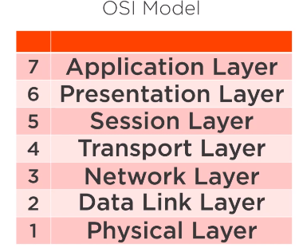
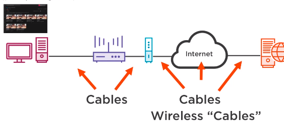
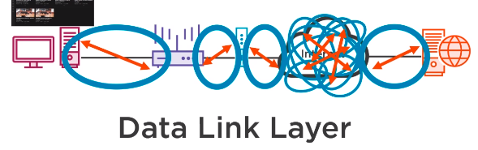
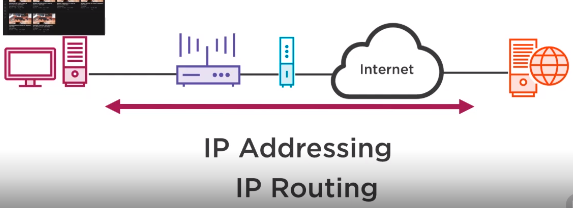
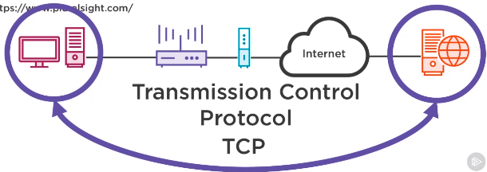
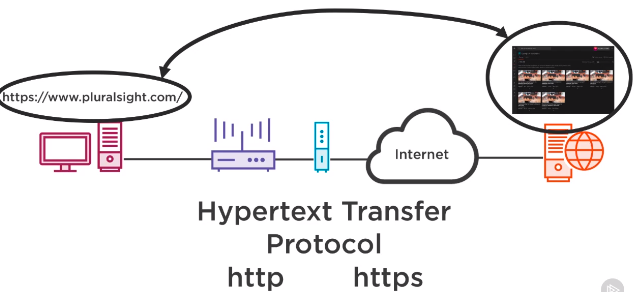

# Open Systems Interconnect (OSI)

OSI has 7 layers that the data passes through.

## Physical Layer

Contains: cables (Twisted pair, CoAx), PCs, routers, servers and wireless etc.

## Data Link Layer

Network segments that allow data to be transferred and managed (usually Ethernet) between devices e.g from a PC to the router.

## Network Layer

**IP Addressing** allows us to send data across vast distances as each device will have a unique address. 
**IP Routing** allows us to send messages from one unique address to another.

## Transport Layer

A session must be established between client and server.
**Transmission Control Protocol (TCP)** allows us to build a session.

## Application Layer

**Hypertext Transfer Protocol (HTTP/S)** Allows hypertext to be transferred from a server to a client. 

