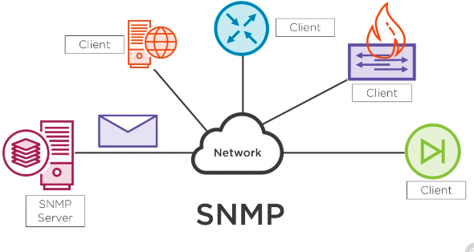

# Simple Network Management Protocol (SNMP)

SNMP uses a server to collect information about clients or SNMP agents.

'walk the tree'  relays information back: port statuses, temperature of device, log messages etc.

